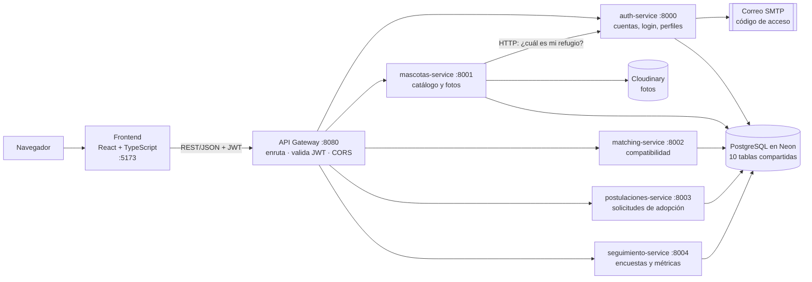
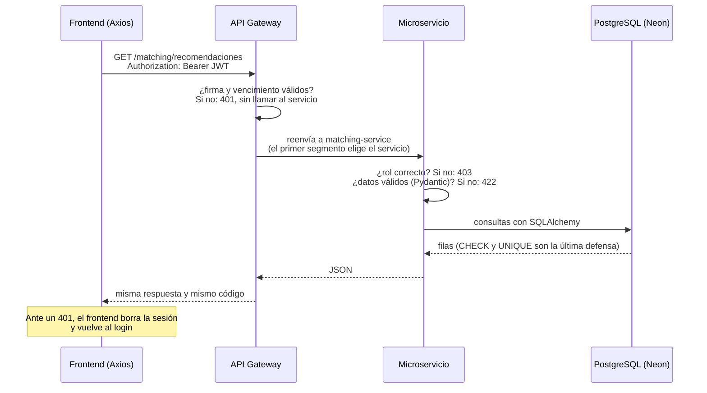
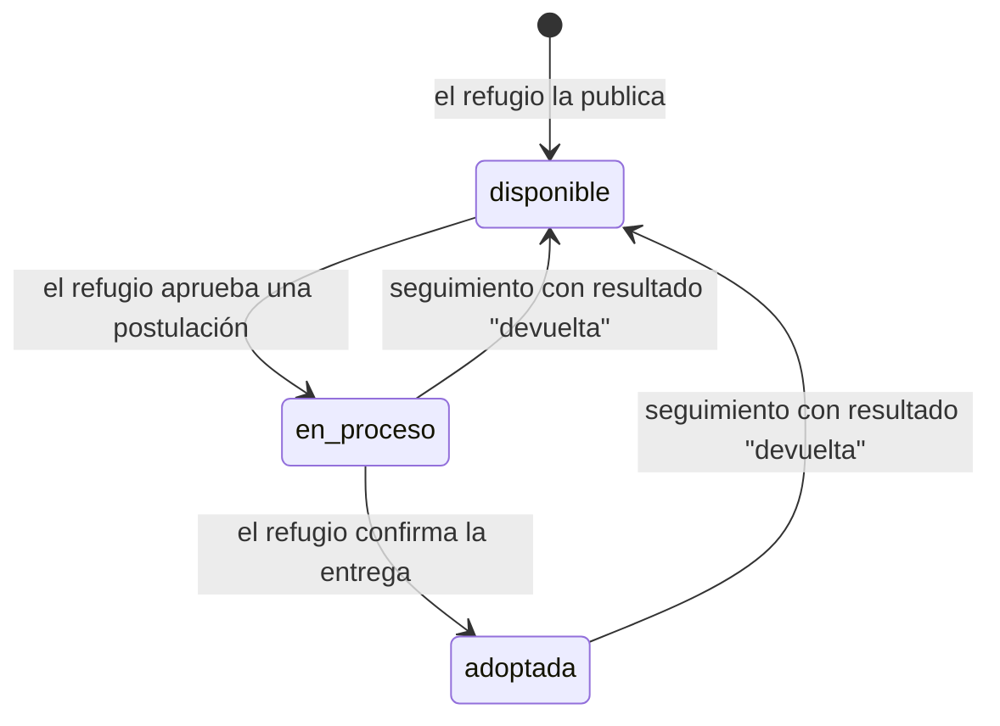
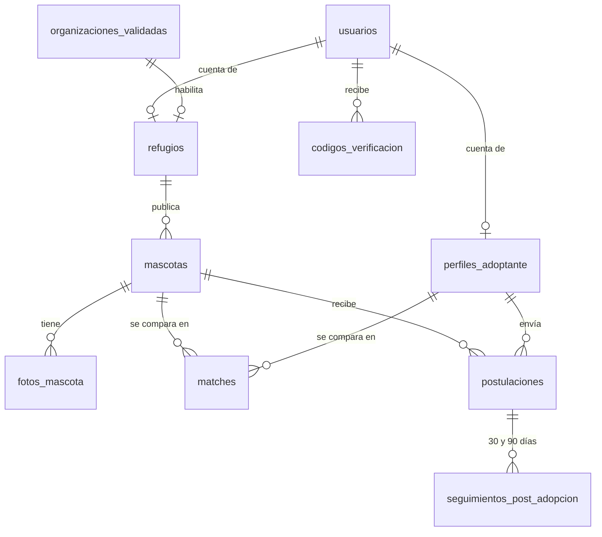

# Guía del proyecto HouseFound

**Estado al 1 de octubre de 2026** · CAPSTONE APT122, sección 004D · Docente: Marco Antonio Valenzuela Contreras
**Equipo:** Orlando Espinoza (Product Owner), Patricio Cárcamo (Scrum Master), Martín Guzmán y Benjamín Ormazábal

Esta guía explica el proyecto tal como está hoy en el código: qué hace, cómo está construido, cómo viajan los datos, por qué se decidió cada cosa y qué falta. Cierra con las preguntas que puede hacer el docente guía en la revisión de avance. El detalle técnico completo está en [SPEC.md](<Fase 2/Evidencias Proyecto/Evidencias de sistema/Aplicación/SPEC.md>), el [README de la base de datos](<Fase 2/Evidencias Proyecto/Evidencias de sistema/Base de datos/README_BaseDeDatos.md>) y el [README de los datos de ejemplo](<Fase 2/Evidencias Proyecto/Evidencias de sistema/Aplicación/seed/README.md>).

## Índice

1. [El proyecto en un minuto](#1-el-proyecto-en-un-minuto)
2. [Estado del avance](#2-estado-del-avance)
3. [Arquitectura](#3-arquitectura)
4. [Flujo del dato](#4-flujo-del-dato)
5. [Modelo de datos](#5-modelo-de-datos)
6. [Motor de compatibilidad](#6-motor-de-compatibilidad)
7. [Seguridad](#7-seguridad)
8. [Datos de ejemplo](#8-datos-de-ejemplo)
9. [Calidad y pruebas](#9-calidad-y-pruebas)
10. [Cómo ejecutarlo y demostrarlo](#10-cómo-ejecutarlo-y-demostrarlo)
11. [Decisiones de diseño](#11-decisiones-de-diseño)
12. [Preguntas probables del docente](#12-preguntas-probables-del-docente)
13. [Limitaciones y próximos pasos](#13-limitaciones-y-próximos-pasos)

---

## 1. El proyecto en un minuto

**Problema.** Entre el 15 % y el 30 % de las mascotas adoptadas en Chile y Latinoamérica vuelve al refugio, casi siempre en los primeros 90 días (Análisis del Caso, sección 2). La causa principal no es la falta de compromiso, sino la incompatibilidad entre la rutina del adoptante y las necesidades del animal. Las plataformas actuales listan mascotas por fecha o con filtros básicos, sin ningún criterio de afinidad.

**Solución.** HouseFound cruza un cuestionario de estilo de vida del adoptante con la ficha de cada mascota y calcula un **% de compatibilidad explicable**: cada punto tiene un motivo visible. El refugio ve ese % y su desglose al evaluar cada postulación. El seguimiento a 30 y 90 días mide si la adopción funcionó.

| Usuario | Qué hace en la plataforma | Cómo inicia sesión |
|---|---|---|
| Adoptante | Responde el cuestionario, recibe recomendaciones ordenadas por compatibilidad y postula | Email y contraseña |
| Refugio | Publica mascotas, evalúa postulaciones y confirma adopciones | RUT de su organización + código de 6 dígitos enviado a su correo |

**En una frase:** no se elige por la foto; la devolución se previene antes de la adopción, con un puntaje que el refugio puede auditar.

---

## 2. Estado del avance

El núcleo del MVP funciona de punta a punta: registro, cuestionario, catálogo con fotos, matching, postulación, aprobación y confirmación de la adopción. Falta la parte visible del seguimiento post-adopción. El Sprint 1 formal parte el 5 de octubre de 2026; lo construido hasta hoy es el incremento base.

| Funcionalidad | Backend | Frontend | Comentario |
|---|---|---|---|
| Registro e inicio de sesión del adoptante | Listo | Listo | JWT de 24 h; bloqueo tras 5 intentos fallidos |
| Inicio de sesión del refugio (RUT + código) | Listo | Listo | Solo organizaciones de la nómina SII |
| Cuestionario del adoptante (v2, 5 pasos) | Listo | Listo | Obligatorio: sin él la app solo muestra el cuestionario y la API rechaza postular |
| Perfil del refugio | Listo | Listo | Nombre, dirección y teléfono de contacto |
| Publicar, editar y cambiar el estado de mascotas | Listo | Listo | Ficha de comportamiento y de salud; raza y edad con selectores |
| Fotos de mascotas | Listo | Listo | Cloudinary, recorte cuadrado, foto principal |
| Recomendaciones y Explorar | Listo | Listo | Matching v2 en 3 capas, con desglose por criterio |
| Ficha de la mascota con compatibilidad | Listo | Listo | Muestra motivos de exclusión y alertas |
| Postular y "Mis solicitudes" | Listo | Listo | |
| Evaluar postulaciones (aprobar, rechazar, confirmar adopción) | Listo | Listo | El refugio ve las respuestas, el % y su desglose |
| Encuestas de seguimiento a 30 y 90 días | Listo | **Pendiente** | Endpoints listos; falta la pantalla |
| Panel de métricas del refugio | Listo | **Pendiente** | `GET /seguimientos/metricas` ya calcula la tasa de devolución |
| Guardados (favoritos) | No existe | Listo | Se guardan solo en el navegador (`localStorage`) |
| Pruebas automatizadas | Parcial | No | 24 pruebas del motor de matching |

**Datos en la base de datos compartida (Neon), al 1 de octubre de 2026:**

| Dato | Cantidad |
|---|---|
| Organizaciones de la nómina SII | 68: 67 reales de 9 regiones + 1 de prueba del equipo |
| Refugios | 68: 1 activo (el de prueba) y 67 pendientes de su primer ingreso |
| Mascotas | 541 de ejemplo (370 perros y 171 gatos) en 67 refugios |
| Mascotas con foto | 463; las otras 78 no tienen una foto confiable de su raza |
| Adoptantes | 3 (1 con el cuestionario completo) |
| Puntajes de compatibilidad calculados | 541 |
| Postulaciones | 1 (pendiente) |
| Seguimientos | 0 |

---

## 3. Arquitectura

**Patrón:** microservicios detrás de un API Gateway, con una base de datos PostgreSQL compartida. Todo corre en 7 contenedores Docker con un solo comando.

| Servicio | Puerto | Responsabilidad | Escribe en | Lee de | Referente |
|---|---|---|---|---|---|
| frontend | 5173 | 17 pantallas para adoptante y refugio | — | — | Patricio |
| api-gateway | 8080 | Único punto de entrada: enruta por el primer segmento de la ruta, rechaza tokens inválidos o vencidos (401), aplica CORS y revisa la salud de los 5 servicios | — | — | Orlando |
| auth-service | 8000 | Registro y login de adoptantes, login de refugios por RUT + código, perfiles | `usuarios`, `perfiles_adoptante`, `refugios`, `codigos_verificacion` | `organizaciones_validadas` | Orlando |
| mascotas-service | 8001 | Publicar, editar, cambiar estado, subir y borrar fotos | `mascotas`, `fotos_mascota` | Pide su refugio a auth-service por HTTP | Martín |
| matching-service | 8002 | Calcula la compatibilidad adoptante–mascota | `matches` | `perfiles_adoptante`, `mascotas`, `fotos_mascota` | Benjamín |
| postulaciones-service | 8003 | Postular, aprobar o rechazar, confirmar la adopción | `postulaciones`, estado de `mascotas` | Perfiles, usuarios, refugios, `matches` | Martín |
| seguimiento-service | 8004 | Encuestas a 30 y 90 días y métricas | `seguimientos_post_adopcion`, estado de `mascotas` | Postulaciones, mascotas, refugios | Benjamín |

**Stack:**

| Capa | Tecnología |
|---|---|
| Frontend | React 19, TypeScript, Vite 8, Tailwind CSS 4, React Router 7, Axios |
| Backend | Python 3.12, FastAPI, Pydantic 2, SQLAlchemy 2, uvicorn |
| Seguridad | JWT HS256 (python-jose), bcrypt (passlib) |
| Datos | PostgreSQL en Neon (nube, plan gratuito) |
| Archivos | Cloudinary (CDN de imágenes) |
| Infraestructura | Docker y Docker Compose |

---

## 4. Flujo del dato

### 4.1 Recorrido de una petición

Toda petición del navegador pasa por el gateway. Cada capa rechaza lo que le corresponde lo antes posible.

El token se guarda en `sessionStorage`, así que la sesión termina al cerrar la pestaña. Axios lo agrega solo a cada petición ([client.ts](<Fase 2/Evidencias Proyecto/Evidencias de sistema/Aplicación/frontend/src/api/client.ts>)).

### 4.2 Ciclo completo de una adopción

| # | Quién | Qué pasa | Datos que se escriben |
|---|---|---|---|
| 0 | Equipo (script) | Se importa la nómina SII y se crea un refugio "pendiente" por organización | `organizaciones_validadas`, `usuarios`, `refugios` |
| 1 | Refugio | Escribe su RUT y recibe en el correo de la nómina un código de 6 dígitos (10 min, un solo uso). Al verificarlo, su cuenta queda activa y recibe su JWT | `codigos_verificacion` (solo el hash), `usuarios.estado` |
| 2 | Refugio | Completa la ficha de la mascota y sube fotos. mascotas-service le pregunta a auth-service a qué refugio pertenece el token | `mascotas`, `fotos_mascota` (URL de Cloudinary) |
| 3 | Adoptante | Crea su cuenta con email y contraseña (guardada con bcrypt) | `usuarios`, `perfiles_adoptante` (solo teléfono) |
| 4 | Adoptante | Responde el cuestionario de 5 pasos. Hasta terminarlo, la app no le muestra otra pantalla | `perfiles_adoptante` |
| 5 | Adoptante | Abre Recomendaciones: matching-service evalúa todas las mascotas disponibles y guarda cada resultado en una sola operación UPSERT | `matches` (% y desglose en JSON) |
| 6 | Adoptante | Postula desde la ficha. Se exige cuestionario completo, mascota disponible y que no tenga otra postulación pendiente a la misma mascota | `postulaciones` (pendiente) |
| 7 | Refugio | Revisa las respuestas del postulante, el % y su desglose. Al aprobar, la mascota queda "en proceso" y las demás postulaciones pendientes a ella se rechazan solas | `postulaciones.estado`, `mascotas.estado` |
| 8 | Ambos | Con la postulación aprobada, cada uno ve el WhatsApp del otro para coordinar la entrega | — |
| 9 | Refugio | Confirma que entregó la mascota: pasa a "adoptada" | `mascotas.estado` |
| 10 | Adoptante | Responde la encuesta a los 30 y 90 días. Si la mascota fue devuelta, vuelve a estar disponible | `seguimientos_post_adopcion` (pantalla pendiente) |
| 11 | Refugio | Consulta su tasa de devolución: devueltas ÷ (exitosas + devueltas) | — (pantalla pendiente) |

El % se recalcula cada vez que el adoptante abre Recomendaciones o una ficha, así que siempre refleja su último cuestionario. Postulaciones no calcula nada: lee el % que matching dejó en `matches`.

### 4.3 Estados de la mascota y de la postulación

- **Postulación:** `pendiente` → `aprobada` o `rechazada`. Al aprobar una, las demás pendientes a la misma mascota pasan a `rechazada`.
- **Regla RN02:** una mascota solo pasa a `adoptada` cuando el refugio lo confirma; nunca de forma automática.

---

## 5. Modelo de datos

10 tablas en PostgreSQL. El script completo es [BD_HouseFound_v2.sql](<Fase 2/Evidencias Proyecto/Evidencias de sistema/Base de datos/BD_HouseFound_v2.sql>) y ya incluye las 6 migraciones.

**Reglas que la propia base de datos hace cumplir:**

- **Catálogos cerrados con `CHECK`:** rol, estados, tipo de vivienda, nivel de energía, etc. solo aceptan valores definidos.
- **Coherencia:** edad no negativa, % entre 0 y 1, tamaño adulto solo en perros, cuidados especiales siempre descritos.
- **Sin duplicados:**
  - una sola foto principal por mascota;
  - un solo cálculo por par adoptante–mascota (se actualiza);
  - una sola postulación *pendiente* por par adoptante–mascota.
- **Borrado:** el historial (`matches`, `postulaciones`, `seguimientos_post_adopcion`) está protegido con `ON DELETE RESTRICT`. Las extensiones de una cuenta (perfiles, fotos) se borran en cascada.

**Migraciones (todas aplicadas en Neon):**

| Migración | Qué cambió |
|---|---|
| 001 | Tabla con la nómina SII de organizaciones de rescate animal |
| 002 | Login de refugios con RUT + código; tabla `codigos_verificacion` |
| 003 | Todo refugio debe pertenecer a una organización de la nómina |
| 004 | Marca de datos de ejemplo (`origen = 'seed'`, `clave_seed`) |
| 005 | Paso intermedio: especie preferida y especie de catálogo cerrado |
| 006 | Cuestionarios v2, ficha de salud y desglose del % en `matches` |

---

## 6. Motor de compatibilidad

Está en [scoring.py](<Fase 2/Evidencias Proyecto/Evidencias de sistema/Aplicación/backend/matching-service/scoring.py>). Cada pregunta al adoptante tiene su espejo en la ficha de la mascota, y el resultado se arma en 3 capas.

| Pregunta al adoptante | Dato de la mascota | Capa |
|---|---|---|
| Restricciones de la vivienda (solo gatos, solo pequeñas) | Especie y tamaño | 1. Exclusión |
| Alergias | Especie | 1. Exclusión |
| Niños en casa y su edad | Convivencia con niños | 1. Exclusión |
| Perros o gatos en casa | Convive con perros / con gatos | 1. Exclusión |
| Cuidados especiales que puede asumir | Nivel de cuidados | 1. Exclusión |
| Horas que quedaría sola | Tolerancia a la soledad | 2. Compatibilidad (30 %) |
| Tiempo para pasear y jugar | Nivel de energía | 2. Compatibilidad (25 %) |
| Experiencia previa | Experiencia requerida | 2. Compatibilidad (20 %) |
| Ambiente del hogar (tranquilo a movido) | Temperamento | 2. Compatibilidad (15 %) |
| Tipo de vivienda | Espacio mínimo | 2. Compatibilidad (10 %) |
| Especie preferida | Especie | 3. Preferencia (filtra) |
| Tamaños, etapas de vida y sexo preferidos | Tamaño, edad y sexo | 3. Preferencia (solo ordena) |

**Las reglas:**

1. **Exclusión (¿es seguro?).** Una mascota excluida no aparece en Recomendaciones. En Explorar se muestra como "No compatible" con su motivo. La exclusión no cambia el %.
2. **Compatibilidad (¿puede cuidarla bien?).** Cada criterio compara un recurso del hogar con una necesidad de la mascota:
   - 1,0 si la cubre, 0,5 si le falta un nivel, 0,0 si le faltan dos o más;
   - tener de más nunca resta;
   - **tope:** si un criterio queda en 0, el total no supera el 50 %.
3. **Preferencias (¿es lo que busca?).** La especie filtra la lista. Tamaño, etapa y sexo solo ordenan: primero las que cumplen más preferencias y, a igualdad, las de mayor %.

**Dato faltante:** si la ficha no dice si la mascota convive con niños, perros o gatos (`NULL`), nunca se excluye por eso. Se muestra una alerta ("no evaluado").

**Ejemplo calculado con el motor real.** El adoptante vive en departamento y la mascota quedaría sola de 4 a 8 h. Tiene 30–60 min diarios para pasear, experiencia básica y un hogar moderado. Vive con un gato y no tiene niños. La mascota es un perro mediano de 3 años: necesita casa con patio, tolera 2–4 h solo, tiene energía alta y requiere experiencia media. Es reservado y convive con gatos.

| Criterio | Adoptante | Mascota | Puntaje | Peso | Aporte |
|---|---|---|---|---|---|
| Soledad | sola 4–8 h | tolera 2–4 h | 0,5 (falta 1 tramo) | 30 % | 15,0 |
| Actividad | 30–60 min | energía alta | 0,5 | 25 % | 12,5 |
| Experiencia | básica | media | 1,0 | 20 % | 20,0 |
| Ambiente | moderado | reservado | 1,0 | 15 % | 15,0 |
| Espacio | departamento | casa con patio | 0,5 | 10 % | 5,0 |
| **Total** | | | | | **67,5 %** (la app lo muestra redondeado: 68 %) |

- **Mismo perro, pero sin convivir con gatos:** queda excluido ("No convive bien con gatos"). Su % sigue en 67,5, pero no se recomienda.
- **Mismo adoptante, pero sola más de 8 h:** soledad = 0. La suma da 52,5 %, pero el tope la deja en **50 %**.

**Evolución del algoritmo (v1 → v2).** El Análisis del Caso v2.0 describe la versión 1. El código implementa la versión 2:

| Aspecto | v1 (Análisis del Caso) | v2 (código actual) | Por qué cambió |
|---|---|---|---|
| Estructura | 6 criterios en un promedio ponderado | 3 capas: exclusión, %, preferencias | Un riesgo de seguridad no debe esconderse en un promedio: en el ejemplo de v1, un perro que no convive con el gato del adoptante obtenía 70 % "aceptable" |
| Niños y otras mascotas | 10 % de peso cada uno | Exclusión; distingue perros de gatos y la edad de los niños | La convivencia con otras mascotas es una de las primeras causas de devolución |
| Forma de comparar | "Cercanía" en actividad y tiempo | "Cumple o supera" en todo | Tener más recursos no debe restar: una persona activa puede adoptar un perro senior tranquilo |
| Dato faltante | Beneficio de la duda (1,0) | Alerta visible, nunca excluye | Transparencia: el adoptante sabe qué falta confirmar |
| Pesos | 20/20/20/20/10/10 | 30/25/20/15/10 + tope del 50 % | Orden de las causas de devolución en la literatura (Powell et al. 2021; Mundschau y Suchak 2023) |
| Tiempo | Horas en casa por día | Horas que quedaría sola | Mide directamente lo que la mascota tolera |

---

## 7. Seguridad

| Medida | Dónde | Qué protege |
|---|---|---|
| Contraseñas con bcrypt | auth-service | Una filtración de la BD no expone contraseñas |
| JWT HS256 de 24 h con id y rol | auth emite; gateway y servicios validan | Sesión sin estado; el gateway corta tokens inválidos antes de reenviar |
| Rol exigido en cada endpoint (`requerir_rol`) | Cada microservicio | Un adoptante no puede usar endpoints de refugio (403) |
| Propiedad de los datos | mascotas, postulaciones | Un refugio solo modifica sus mascotas y sus postulaciones |
| Bloqueo por 15 min tras 5 intentos fallidos | auth-service | Fuerza bruta sobre una cuenta |
| Hash señuelo y mensaje genérico en el login | auth-service | Que no se pueda saber, por el mensaje o el tiempo de respuesta, si un email está registrado |
| Refugios sin contraseña: RUT de la nómina + código | auth-service | Solo organizaciones reales operan como refugio |
| Código guardado como HMAC-SHA256, 10 min, un uso, 5 intentos, reenvío cada 60 s, máx. 5 por hora | auth-service | Adivinar o reutilizar códigos |
| RUT validado con dígito verificador (módulo 11) | auth-service | RUT mal escritos o inventados |
| CORS configurado solo en el gateway | api-gateway | Solo el frontend puede llamar a la API desde un navegador |
| Sesión en `sessionStorage`; un 401 cierra la sesión | frontend | Sesiones olvidadas en equipos compartidos |
| Bloqueo de fila (`SELECT … FOR UPDATE`) al aprobar | postulaciones, seguimiento | Que dos aprobaciones simultáneas "ganen" la misma mascota |
| `CHECK`, `UNIQUE` y `ON DELETE RESTRICT` | Base de datos | Datos inválidos aunque falle una validación del código |
| Secretos solo en archivos `.env` fuera de Git | Todos | Credenciales de Neon, Cloudinary y JWT |

---

## 8. Datos de ejemplo

- **Refugios reales.** Las 67 organizaciones vienen de la nómina SII de organizaciones de rescate animal. La de prueba (RUT 11.111.111-1) es del equipo.
- **Mascotas sintéticas.** [generar_mascotas.py](<Fase 2/Evidencias Proyecto/Evidencias de sistema/Aplicación/seed/generar_mascotas.py>) crea 541 mascotas con proporciones configurables y [cargar_mascotas.py](<Fase 2/Evidencias Proyecto/Evidencias de sistema/Aplicación/seed/cargar_mascotas.py>) las carga. Sus propiedades:
  - **deterministas:** la misma semilla genera siempre el mismo resultado;
  - **trazables:** `origen = 'seed'`, así que se pueden borrar en bloque;
  - **coherentes**, por ejemplo:
    - un cachorro nunca tiene energía baja y un senior nunca alta;
    - un perro grande necesita casa con patio;
    - una mascota reactiva no convive con niños ni con otros animales;
    - cerca del 10 % de las convivencias queda "sin evaluar", como en las fichas reales.
- **Fotos.** Se buscaron en Pixabay (licencia libre) y se validaron por especie, raza y edad, primero por etiquetas y luego mirando cada foto. Después se subieron a Cloudinary en 480×480.
  - 463 mascotas tienen foto.
  - 78 quedaron sin foto (70 mestizos y 8 gatos de raza): es preferible a mostrar un animal que no corresponde.
- **Por qué:** permite probar el matching con volumen real sin inventar refugios. Al pasar a producción se borran con un comando.

---

## 9. Calidad y pruebas

- **24 pruebas unitarias del motor de matching** en [test_scoring.py](<Fase 2/Evidencias Proyecto/Evidencias de sistema/Aplicación/backend/matching-service/test_scoring.py>). El 1 de octubre de 2026 pasaron las 24.

  | Grupo | Pruebas | Qué verifican |
  |---|---|---|
  | Compatibilidad | 8 | Pesos suman 1; un hogar que cubre todo da 100 %; un nivel de brecha resta la mitad del peso; tener de más no resta; tope del 50 %; mascota tímida y hogar tranquilo; desglose completo |
  | Exclusiones | 8 | Niños pequeños y mayores, perros y gatos por separado, alergias, vivienda, cuidados; la exclusión no cambia el % |
  | Alertas | 2 | Un dato sin evaluar nunca excluye; vivienda por confirmar |
  | Preferencias | 4 | No cambian el %; el tamaño no aplica a gatos; especie; etapas de vida |
  | Cuestionario | 2 | Completo o incompleto; formato JSON guardado en `matches` |

  Se ejecutan desde `backend/matching-service`, con su entorno virtual activo: `python -m unittest test_scoring -v`
- **Verificaciones manuales:**
  - la API responde 400 al postular sin cuestionario y no escribe nada;
  - los selectores de raza y edad se probaron en celular y en escritorio;
  - las 463 fotos se verificaron en la BD y en Cloudinary.
- **Base de datos:** el esquema se probó intentando violar cada regla de negocio (ver el README de la base de datos).
- **Brecha:** la Definition of Done pide pruebas pytest, y hoy solo el matching las tiene. Faltan pruebas de auth, postulaciones, seguimiento y gateway, y del frontend.

---

## 10. Cómo ejecutarlo y demostrarlo

1. Instalar Docker Desktop y crear el `.env` de cada servicio a partir de su `.env.example`.
2. Desde `Aplicación/`, ejecutar: `docker compose up --build`
3. Abrir:
   - la app en http://localhost:5173;
   - la salud de los 5 servicios en http://localhost:8080;
   - la documentación interactiva de cada servicio en `/docs` (por ejemplo, http://localhost:8002/docs).

**Guion de demo (unos 5 minutos):**

1. http://localhost:8080: los 5 servicios responden "ok".
2. Ingresar como el refugio de prueba (RUT 11.111.111-1, con el código de prueba del `.env`) y publicar una mascota con foto.
3. Registrar un adoptante nuevo: la app lo lleva directo al cuestionario. Completarlo.
4. Recomendaciones: mostrar el % y su desglose. En Explorar, mostrar una mascota "No compatible" con su motivo.
5. Postular a la mascota publicada en el paso 2.
6. Volver como refugio:
   - ver las respuestas del postulante y el desglose;
   - aprobar la postulación;
   - mostrar el botón de WhatsApp;
   - confirmar la adopción.

---

## 11. Decisiones de diseño

| Decisión | Alternativa descartada | Por qué |
|---|---|---|
| Microservicios con API Gateway | Monolito | Cada integrante es dueño de uno o dos servicios y avanza en paralelo; el gateway oculta la división al frontend |
| Base de datos compartida | Una BD por servicio | El matching cruza perfiles y mascotas en cada cálculo; separar las BD obligaría a replicar datos. Cada servicio mapea solo las columnas que usa |
| El gateway valida la firma del JWT, pero no los roles | Roles también en el gateway | Una sola fuente de verdad por regla; duplicarla abre inconsistencias |
| Reglas ponderadas explicables | Machine Learning | Sin historial no hay qué entrenar, y las reglas se pueden auditar. El seguimiento genera los datos para un modelo futuro |
| Guardar el desglose del % (JSON en `matches`) | Guardar solo el % | El refugio ve el porqué, y se podrán recalibrar los pesos comparando con los resultados reales |
| Refugios con RUT + código al correo de la nómina | Registro abierto con contraseña | Impide refugios falsos; la nómina SII es la fuente de verdad |
| Fotos en Cloudinary | Disco del servidor | Contenedores sin estado, CDN y recorte automático |
| PostgreSQL en Neon | BD local de cada integrante | Todo el equipo trabaja con los mismos datos, sin costo |
| Sesión en `sessionStorage` | `localStorage` | La sesión termina al cerrar la pestaña |
| Cuestionario obligatorio, exigido en frontend **y** backend | Cuestionario opcional | Sin respuestas no hay % ni información para el refugio; el backend no confía en el frontend |
| Exclusión separada del % | Restar puntos en el % | Un riesgo de seguridad no se compensa con buenos puntajes en otros criterios |

---

## 12. Preguntas probables del docente

**¿Qué problema resuelven y cómo saben que existe?**
Las devoluciones de mascotas adoptadas: alrededor del 15 % en EE. UU. (Protopopova y Gunter, 2017), más del 20 % en México, y entre 15 % y 30 % según refugios de la región. La literatura atribuye la mayoría a incompatibilidad y problemas de conducta, no a falta de compromiso.

**¿Qué los diferencia de un portal de adopción común?**
Ordenan por compatibilidad y no por fecha. El % se explica criterio por criterio, excluye combinaciones riesgosas antes de que ocurran, y el seguimiento mide el resultado real.

**¿Cómo se calcula el %? Muestren un ejemplo.**
Ver la [sección 6](#6-motor-de-compatibilidad): cinco criterios "cumple o supera" con pesos 30/25/20/15/10 y un tope del 50 % ante una brecha crítica. El ejemplo da 67,5 %.

**¿De dónde salen los pesos?**
Del orden de las causas de devolución en estudios publicados: la ansiedad por separación y el exceso de energía pesan más que el espacio (Powell et al. 2021; Mundschau y Suchak 2023). Son un punto de partida declarado: se recalibrarán con los resultados de los seguimientos.

**¿Por qué el algoritmo del Análisis del Caso no coincide con el código?**
El documento describe la versión 1. Al construirla vimos que promediaba riesgos de seguridad: un perro que no convive con el gato del adoptante salía con 70 %. La versión 2 separa esas exclusiones del %. El documento se actualizará (ver la tabla v1 → v2 en la sección 6).

**¿Qué pasa si la ficha de la mascota no tiene un dato?**
Si falta la convivencia con niños, perros o gatos, nunca se excluye por eso; se muestra una alerta para conversarlo con el refugio. Las preguntas que alimentan el % son obligatorias al publicar.

**¿Por qué microservicios para un MVP?**
Por el reparto del trabajo (cada integrante es dueño de un servicio) y porque demostrar una arquitectura distribuida es un objetivo del proyecto. El costo es más configuración: 7 contenedores y un JWT compartido.

**Si comparten la base de datos, ¿son microservicios de verdad?**
Es un compromiso consciente (patrón *shared database*). Los servicios se despliegan y fallan por separado, y cada uno escribe solo sus tablas, salvo el estado de la mascota. Además, mascotas-service consulta el refugio a auth-service por HTTP. El costo es el acoplamiento por esquema: la migración 006 obligó a actualizar varios servicios a la vez.

**¿Qué pasa si se cae un servicio?**
El gateway responde 503 solo para ese servicio, y el resto sigue funcionando. El health check en http://localhost:8080 muestra cuál está caído.

**¿Cómo evitan que cualquiera se haga pasar por refugio?**
No hay registro abierto de refugios: solo entran organizaciones de la nómina SII, con un código que llega al correo registrado de esa organización.

**¿Cómo protegen las contraseñas y las sesiones?**
Ver la [sección 7](#7-seguridad):
- bcrypt para las contraseñas;
- JWT de 24 h;
- bloqueo tras 5 intentos fallidos;
- hash señuelo contra ataques de tiempo;
- rol validado en cada servicio;
- sesión que muere al cerrar la pestaña.

**¿Qué pasa si se aprueban dos postulaciones a la misma mascota al mismo tiempo?**
La aprobación bloquea la fila de la mascota (`SELECT … FOR UPDATE`). La segunda espera, encuentra la mascota "en proceso" y recibe un 409.

**¿Por qué el adoptante no puede usar la app sin el cuestionario? ¿Y si lo salta llamando a la API?**
Sin respuestas no hay % ni información para el refugio. Por eso se exige en dos lugares: el frontend redirige al cuestionario, y la API rechaza recomendaciones y postulaciones con 400.

**¿Los datos son reales?**
Los refugios sí: nómina SII. Las mascotas son sintéticas pero coherentes, y sus fotos son de stock con licencia libre. Están marcadas como `seed` para borrarlas en bloque.

**¿Qué pruebas tienen?**
24 pruebas unitarias del motor, todas en verde, más verificaciones manuales de los flujos. La brecha es que faltan pruebas automatizadas de los demás servicios y del frontend (ver la [sección 9](#9-calidad-y-pruebas)).

**¿Cómo van a medir si HouseFound reduce las devoluciones?**
Con los indicadores del Análisis del Caso:
- tasa de devolución a 90 días;
- % promedio de las adopciones exitosas frente a las devueltas: si el modelo sirve, debe ser mayor en las exitosas.

El backend ya calcula la tasa de devolución; falta la pantalla.

**¿Dónde está el Machine Learning?**
Fuera del alcance del MVP. Primero se necesitan datos de resultados reales, que es lo que genera el seguimiento a 30 y 90 días. El desglose guardado en `matches` sirve como variables de entrada para ese modelo futuro.

**¿Qué falta para terminar el MVP?**
Las pantallas de seguimiento y métricas, más pruebas automatizadas. Ver la [sección 13](#13-limitaciones-y-próximos-pasos).

**¿Cómo trabajan en equipo y con Git?**
Scrum con sprints de 2 semanas desde el 5 de octubre de 2026, con el backlog en GitHub Projects. Hay que ser honestos: la integración reciente se hizo directo a `main`. Desde el Sprint 1, todo cambio entra por rama `feature/*` y Pull Request revisado, como dice el acuerdo del Squad.

**¿Qué datos personales guardan y cómo los cuidan?**
- **Adoptante:** nombre, email, teléfono, foto y respuestas del cuestionario.
- **Refugio:** datos públicos de la nómina.

Las contraseñas se guardan hasheadas y los secretos viven fuera de Git. El teléfono solo se muestra con la postulación aprobada. Falta una política de privacidad y un consentimiento explícito (Ley 19.628).

**¿Cómo escalaría?**
Los servicios no guardan estado (salvo el contador de intentos de login), así que se pueden replicar detrás del gateway. Con varias réplicas, ese contador debe pasar a Redis o a una tabla.

---

## 13. Limitaciones y próximos pasos

| Área | Situación actual | Qué hacer |
|---|---|---|
| Funcionalidad | Encuestas de seguimiento y panel de métricas sin pantalla (el backend está listo) | Construir ambas pantallas; cierran el objetivo de medir devoluciones |
| Funcionalidad | "Guardados" vive solo en el navegador | Endpoint en el backend |
| Funcionalidad | Solo la organización de prueba tiene correo, y el `.env` no configura SMTP: los refugios reales aún no pueden ingresar | Cargar correos verificados de la nómina y configurar SMTP |
| Calidad | Pruebas automatizadas solo en el matching | Pruebas pytest de auth, postulaciones (flujo de aprobación), seguimiento y gateway, como pide la Definition of Done |
| Seguridad | RN06 se cumple solo en la interfaz: la API entrega los teléfonos en cualquier estado de la postulación | Enviar los teléfonos solo con la postulación aprobada (`_a_postulacion_out` en postulaciones-service) |
| Seguridad | Mínimo de 6 caracteres en la contraseña solo en el frontend | Validarlo también en `UsuarioRegistro` (auth-service) |
| Seguridad | Si falta `JWT_SECRET`, los servicios usan una clave por defecto | Que el servicio no arranque sin ella |
| Seguridad | `MODO_DEV` y `CODIGO_PRUEBA` habilitados para desarrollo | Desactivarlos en producción |
| Seguridad | El contador de intentos de login vive en memoria: se reinicia con el contenedor | Redis o tabla si hay más de una réplica |
| Técnica | La lista de preguntas obligatorias del cuestionario se repite en matching, postulaciones y frontend | Unificarla en un solo lugar |
| Técnica | Solo corre en local con Docker | Desplegar en la nube para la demo final |
| Documentación | El Análisis del Caso describe el matching v1 | Actualizar sus secciones 4.2 y 4.3 |
| Documentación | El README raíz dice "desarrollo aún no iniciado" | Actualizar |
| Documentación | SPEC RF-01 a RF-04 desactualizados (ej. "registro de refugios", "6 criterios") | Actualizar |
| Documentación | Diagrama ER en PNG anterior a las migraciones | Regenerar desde `BD_HouseFound_v2.sql` |
| Proceso | Commits directos a `main` | Ramas `feature/*` + Pull Request desde el Sprint 1 |
