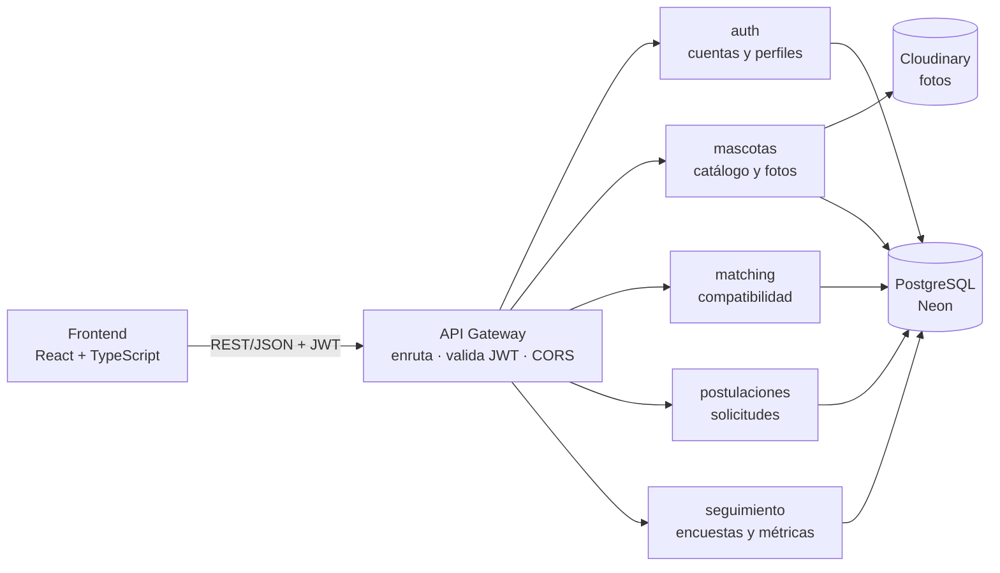

<div align="center">

# 🐾 HouseFound

**Recomienda mascotas en adopción según su compatibilidad con la vida del adoptante, para que menos vuelvan al refugio.**

Proyecto CAPSTONE (APT122) · Ingeniería en Informática · Duoc UC

[](https://frontend-zavd.onrender.com)
[](https://github.com/OrlandoIsaias/CAPSTONE/actions/workflows/rama-deploy.yml)


</div>

<!--
CAPTURAS PENDIENTES: agregar 1 a 3 imágenes en docs/img/ y enlazarlas aquí, por ejemplo:

Pantallas sugeridas: Recomendaciones, ficha de una mascota con el desglose del %
y evaluación de una postulación desde el refugio.
-->

> **Nota:** la app publicada usa el plan gratuito de Render. Si nadie la usó en los últimos 15 minutos, la primera carga de datos puede tardar hasta un minuto.

---

## Por qué existe

Refugios y rescatistas de Chile y Latinoamérica reportan que entre el 15 % y el 30 % de las mascotas adoptadas son devueltas o abandonadas, la mayoría dentro de los primeros 90 días ([Análisis del Caso](<Fase 2/Evidencias Proyecto/Evidencias de documentación/01_Analisis_del_Caso.docx>), sección 2). La causa principal no es la falta de compromiso, sino la incompatibilidad entre la rutina del adoptante y las necesidades del animal. Las plataformas actuales listan mascotas por fecha o con filtros básicos, sin ningún criterio de afinidad.

HouseFound cruza un cuestionario de estilo de vida del adoptante con la ficha de cada mascota y calcula un **porcentaje de compatibilidad explicable**: cada punto tiene un motivo visible. El refugio ve ese porcentaje y su desglose al evaluar cada postulación, y el seguimiento a 30 y 90 días mide si la adopción funcionó.

## Qué hace

**Adoptante**

- Se registra con email y contraseña.
- Responde un cuestionario de estilo de vida en 5 pasos.
- Recibe recomendaciones ordenadas por compatibilidad, con el desglose de cada porcentaje y los motivos por los que una mascota no es compatible.
- Postula y sigue el estado de sus solicitudes.

**Refugio**

- Ingresa con el RUT de su organización (nómina del SII) y un código de 6 dígitos enviado a su correo.
- Publica y edita mascotas con su ficha de comportamiento, salud y fotos.
- Evalúa cada postulación viendo las respuestas del postulante y su compatibilidad.
- Aprueba o rechaza postulaciones y confirma la adopción.

## Estado del proyecto

El núcleo del MVP funciona de punta a punta. El equipo trabaja en sprints desde el 5 de octubre de 2026.

- [x] Registro e inicio de sesión del adoptante (JWT, bloqueo tras 5 intentos fallidos)
- [x] Ingreso de refugios por RUT y código de verificación, probado con el refugio de prueba
- [x] Cuestionario de estilo de vida, obligatorio para usar la app y postular
- [x] Publicación de mascotas con fotos
- [x] Recomendaciones y Explorar con porcentaje de compatibilidad, desglose y motivos de exclusión
- [x] Postulación, evaluación por el refugio y confirmación de la adopción
- [x] Publicación en internet con despliegue automático
- [ ] Envío del código por correo a los refugios reales (falta configurar el correo saliente y cargar sus direcciones)
- [ ] Pantallas de las encuestas de seguimiento a 30 y 90 días (el backend ya está listo)
- [ ] Panel de métricas del refugio (el backend ya calcula la tasa de devolución)
- [ ] Pruebas automatizadas fuera del motor de compatibilidad
- [ ] Instalación como app en el teléfono (PWA)

Detalle por funcionalidad y limitaciones conocidas: [Guía del proyecto, secciones 2 y 13](GUIA_DEL_PROYECTO.md#2-estado-del-avance).

## Cómo se calcula la compatibilidad

Cada pregunta al adoptante tiene su espejo en la ficha de la mascota, y el resultado se arma en 3 capas:

1. **Exclusión (¿es seguro?).** Alergias, niños, otras mascotas en casa, restricciones de la vivienda y cuidados especiales. Una mascota excluida no se recomienda, y la app muestra el motivo.
2. **Compatibilidad (¿puede cuidarla bien?).** Un porcentaje ponderado:

   | Criterio | Peso |
   |---|---|
   | Horas que quedaría sola | 30 % |
   | Tiempo para pasear y jugar | 25 % |
   | Experiencia previa | 20 % |
   | Ambiente del hogar | 15 % |
   | Tipo de vivienda | 10 % |

   Tener más recursos de los necesarios nunca resta. Si un criterio queda en cero, el total no supera el 50 %.
3. **Preferencias (¿es lo que busca?).** La especie filtra la lista; el tamaño, la edad y el sexo solo cambian el orden.

Si la ficha no indica si la mascota convive con niños, perros o gatos, nunca se excluye por eso: la app muestra una alerta. Las reglas completas, un ejemplo calculado y el cambio de la versión 1 a la 2 están en la [Guía del proyecto, sección 6](GUIA_DEL_PROYECTO.md#6-motor-de-compatibilidad).

## Arquitectura

Microservicios detrás de un API Gateway, con una base de datos PostgreSQL compartida. En local corren en 7 contenedores Docker con un solo comando.



| Servicio | Puerto | Responsabilidad |
|---|---|---|
| frontend | 5173 | Pantallas del adoptante y del refugio |
| api-gateway | 8080 | Punto de entrada único: enruta, valida el token y revisa la salud de los 5 servicios |
| auth-service | 8000 | Registro, inicio de sesión y perfiles |
| mascotas-service | 8001 | Publicación de mascotas y fotos |
| matching-service | 8002 | Cálculo de la compatibilidad |
| postulaciones-service | 8003 | Postulaciones, aprobación y adopción |
| seguimiento-service | 8004 | Encuestas a 30 y 90 días y métricas |

La base de datos es una sola, compartida por todos los servicios, porque el futuro modelo de Machine Learning necesita cruzar datos de varias tablas sin procesos de integración adicionales. Más detalle en la [Guía del proyecto, sección 3](GUIA_DEL_PROYECTO.md#3-arquitectura).

## Stack

| Capa | Tecnología |
|---|---|
| Frontend | React 19, TypeScript, Vite 8, Tailwind CSS 4, React Router 7 |
| Backend | Python 3.12, FastAPI, Pydantic 2, SQLAlchemy 2 |
| Seguridad | JWT (HS256) y bcrypt |
| Datos | PostgreSQL en Neon |
| Imágenes | Cloudinary |
| Infraestructura | Docker, Docker Compose, Render y GitHub Actions |
| Pruebas | unittest de Python |

## Cómo ejecutarlo en local

**Requisitos:** [Docker Desktop](https://www.docker.com/products/docker-desktop/) y los valores de los `.env`: la conexión a la base de datos de Neon, el `JWT_SECRET` y las credenciales de Cloudinary. El equipo los entrega por un canal privado.

1. Clonar el repositorio y entrar a la carpeta de la app:

   ```bash
   git clone https://github.com/OrlandoIsaias/CAPSTONE.git
   cd "CAPSTONE/Fase 2/Evidencias Proyecto/Evidencias de sistema/Aplicación"
   ```

2. En cada carpeta de `backend/`, copiar `.env.example` como `.env` y completar los valores. `JWT_SECRET` debe ser **igual en los 6 servicios**, y los `.env` nunca se suben a git.

3. Levantar todo:

   ```bash
   docker compose up --build
   ```

4. Abrir:

   | Qué | URL |
   |---|---|
   | La app | http://localhost:5173 |
   | Estado de los 5 servicios | http://localhost:8080 |
   | Documentación interactiva de la API | `/docs` de cada servicio, por ejemplo http://localhost:8002/docs |

**Para probarla:** registrarse como adoptante desde la app, o ingresar como el refugio de prueba con el RUT `11.111.111-1` y el `CODIGO_PRUEBA` del `.env` de auth-service. Para cargar mascotas de ejemplo, ver el [README de los datos de ejemplo](<Fase 2/Evidencias Proyecto/Evidencias de sistema/Aplicación/seed/README.md>).

Cada servicio también se puede levantar sin Docker, con su propio entorno virtual de Python, y el frontend con `npm run dev` (ver el [README del frontend](<Fase 2/Evidencias Proyecto/Evidencias de sistema/Aplicación/frontend/README.md>)).

## Pruebas

Las 24 pruebas unitarias del motor de compatibilidad solo usan la biblioteca estándar de Python:

```bash
cd "Fase 2/Evidencias Proyecto/Evidencias de sistema/Aplicación/backend/matching-service"
python -m unittest test_scoring -v
```

Con la app levantada en Docker, también corren dentro del contenedor: `docker compose exec matching-service python -m unittest test_scoring -v`.

Los demás servicios y el frontend todavía no tienen pruebas automatizadas (ver la [Guía del proyecto, sección 9](GUIA_DEL_PROYECTO.md#9-calidad-y-pruebas)).

## Despliegue

La app está publicada en [Render](https://render.com) con el plan gratuito: el frontend como Static Site, y el gateway y los 5 servicios como Web Services con los mismos `Dockerfile` que en local.

Cada push a `main` que cambie algo dentro de `Aplicación/` se publica solo en 2 a 5 minutos. La Action [`rama-deploy.yml`](.github/workflows/rama-deploy.yml) copia la app a la rama `deploy`, que Render usa porque no acepta la tilde de `Aplicación` en sus rutas. **La rama `deploy` nunca se edita a mano.**

Cómo está armado, sus variables, cómo recrearlo desde cero y qué revisar antes de una demo: [Guía de despliegue](GUIA_DE_DESPLIEGUE.md).

## Documentación

| Documento | Contenido |
|---|---|
| [Guía del proyecto](GUIA_DEL_PROYECTO.md) | El proyecto completo: arquitectura, flujo de los datos, modelo de datos, compatibilidad, seguridad, decisiones de diseño y limitaciones |
| [Guía de despliegue](GUIA_DE_DESPLIEGUE.md) | Publicación en Render, variables de entorno y preparación de una demo |
| [SPEC.md](<Fase 2/Evidencias Proyecto/Evidencias de sistema/Aplicación/SPEC.md>) | Especificación técnica: requisitos, endpoints de la API, variables de entorno y reglas de negocio |
| [README de la base de datos](<Fase 2/Evidencias Proyecto/Evidencias de sistema/Base de datos/README_BaseDeDatos.md>) | Esquema, migraciones y reglas de negocio en la base de datos |
| [README de los datos de ejemplo](<Fase 2/Evidencias Proyecto/Evidencias de sistema/Aplicación/seed/README.md>) | Generación y carga de las mascotas de ejemplo |
| [README del frontend](<Fase 2/Evidencias Proyecto/Evidencias de sistema/Aplicación/frontend/README.md>) | Comandos y estructura del código del frontend |
| [Análisis del Caso](<Fase 2/Evidencias Proyecto/Evidencias de documentación/01_Analisis_del_Caso.docx>) | Problema, contexto, propuesta de solución y marco metodológico. Su sección de matching describe la versión 1 |
| [Squad y responsabilidades](<Fase 2/Evidencias Proyecto/Evidencias de documentación/02_SquadResponsabilidades_HouseFound.docx>) | Roles Scrum, matriz RACI, eventos, acuerdos de trabajo y Definition of Done |
| [Mapa mental](<Fase 2/Evidencias Proyecto/Evidencias de documentación/03_MapaMental_HouseFound.docx>) | Visión general del proyecto |

## Estructura del repositorio

```text
CAPSTONE/
├── .github/workflows/          # Action que publica la app en la rama deploy
├── Fase 1/                     # Evidencias grupales e individuales
├── Fase 2/
│   ├── Evidencias Grupales/
│   ├── Evidencias Individuales/
│   └── Evidencias Proyecto/
│       ├── Evidencias de documentación/   # Análisis del Caso, Squad, mapa mental
│       └── Evidencias de sistema/
│           ├── Aplicación/
│           │   ├── backend/              # API Gateway y 5 microservicios FastAPI
│           │   ├── frontend/             # React + TypeScript
│           │   ├── seed/                 # Generador de mascotas de ejemplo
│           │   ├── docker-compose.yml
│           │   └── SPEC.md
│           └── Base de datos/            # Esquema SQL, migraciones y diagrama
├── Fase 3/
├── GUIA_DEL_PROYECTO.md
├── GUIA_DE_DESPLIEGUE.md
└── README.md
```

## Equipo y metodología

El equipo trabaja con **Scrum**, en sprints de 2 semanas desde el 5 de octubre de 2026. Los roles, eventos y acuerdos están en el documento [Squad y responsabilidades](<Fase 2/Evidencias Proyecto/Evidencias de documentación/02_SquadResponsabilidades_HouseFound.docx>).

| Integrante | Rol Scrum | Área técnica principal |
|---|---|---|
| Orlando Espinoza | Product Owner y Developer | auth-service, API Gateway y despliegue |
| Patricio Cárcamo | Scrum Master y Developer | Frontend |
| Martín Guzmán | Developer | mascotas-service, postulaciones-service e integración con Cloudinary |
| Benjamín Ormazábal | Developer | matching-service y seguimiento-service |

En Scrum no hay jerarquías dentro del equipo: el Product Owner y el Scrum Master también desarrollan. El área técnica ordena el trabajo, pero no es exclusiva: Docker, pruebas, documentación y revisión de Pull Requests son tareas compartidas.

- **Artefactos:** el Product Backlog (historias de usuario y tareas técnicas registradas como issues), el Sprint Backlog, el Scrumboard y el Burndown están en GitHub Projects.
- **Eventos:** Sprint Planning, Daily de lunes a viernes, refinamiento del backlog, Sprint Review y Sprint Retrospective.
- **Definition of Done:** una historia está terminada cuando cumple sus criterios de aceptación, entra a `main` por un Pull Request aprobado por otro integrante, tiene pruebas que pasan, funciona con Docker Compose, su documentación está actualizada y el Product Owner la acepta en la Sprint Review.

**Flujo con Git:** cada historia se desarrolla en una rama `feature/<nombre-tarea>` y entra a `main` por un Pull Request que referencia su issue (`Closes #n`) y que aprueba al menos otro integrante. Los primeros módulos se integraron así (PR #26 a #30), pero los ajustes posteriores se hicieron directo a `main`. Desde el Sprint 1, el equipo está retomando este flujo para todo cambio.

**Contexto académico:** asignatura CAPSTONE APT122, sección 004D, Duoc UC. Docente guía: Marco Antonio Valenzuela Contreras. El docente autorizó al equipo a cursar la asignatura con 4 integrantes, como excepción al máximo de 3 del Instructivo CAPSTONE.
